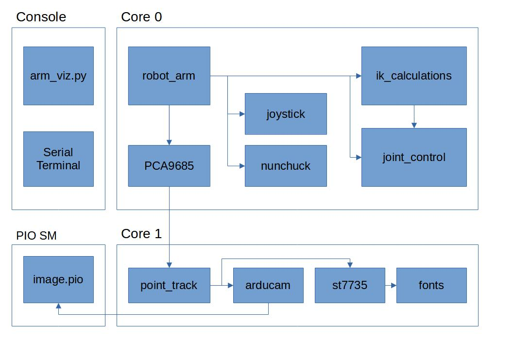

# ese5190-final-project
### Team Lobster 🦞

#### Members
* James Ciardullo
* Nikola Obradovic
* Osamuyi Uwadia

### Overview

Our project consists of a robotic arm that can communicate with the Pico4ML development board to pick up objects in a real world environment.
The arm can be controlled manually using a joystick or keyboard inputs. With the onboard camera of the Pico4ML, the arm can also autonomously identify and move towards a target object.

This flowchart illustrates the relationship between the different software components. See [our project webpage](https://ese-519-team-lobster.github.io/) for more info about the development of the software.

